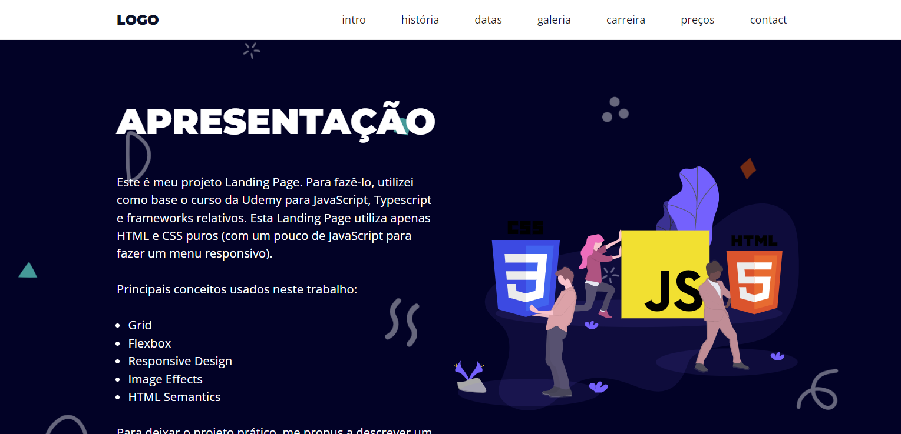

# Formulário de Criação de Cadastro

O seguinte programa foi desenvolvido utilizando como base o curso **Landing Page** através do **Udemy: Curso de Javascript e Typescript do Básico ao Avançado**. 

## Objetivo
Criação de uma **Landing Page** que simule uma página de fotografia com as seguintes características:
* O Usuário poderá navegar pela pagina livremente, acessando cada uma das seções;
* O Usuário poderá usar a barra de menu para navegar pela pagina;
* Usuários de telas menores poderam acessar a pagina com alterações para suavizar a navegação nestes dispositivos;

## Conceitos Utilizados

Trabalho Landing page usando HTML e CSS foram usados vários conceitos, como:

* Design responsivo;
* Navegação dinâmica pela página;
* Tabela;
* Forms;

## Imagem Demonstrativa

